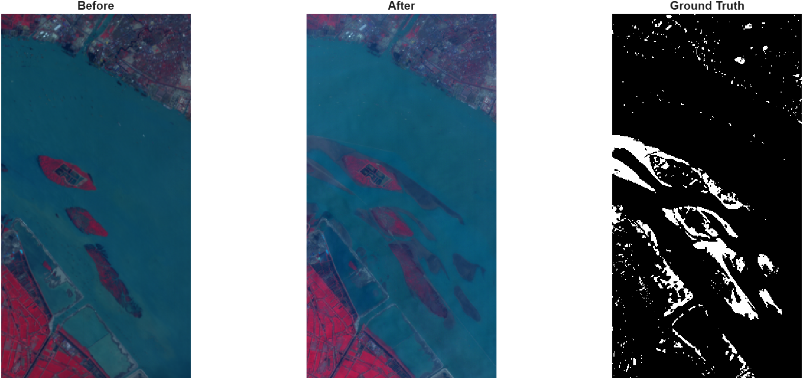
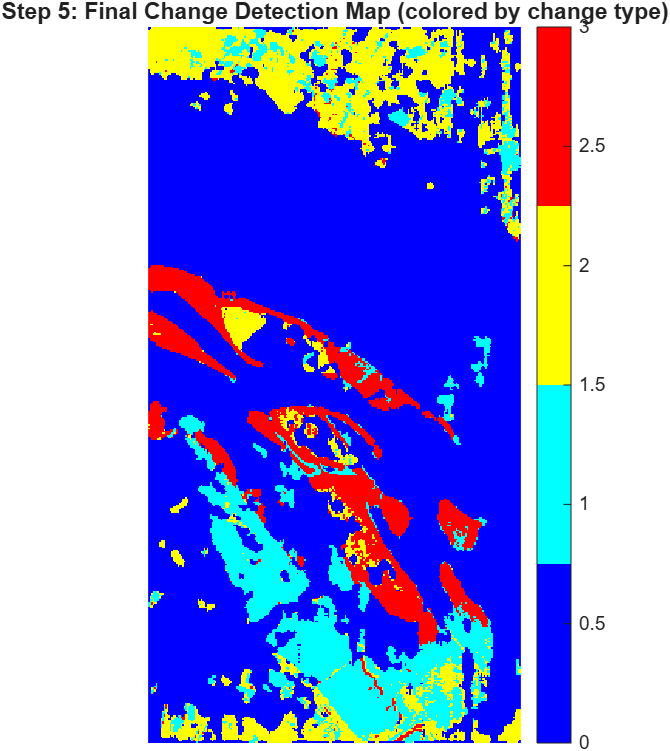

# Hyperspectral Change Detection — River Dataset (GETNET)

A MATLAB-based implementation for hyperspectral change detection using a pair of bitemporal hyperspectral images and a binary ground-truth reference map. The project follows a pseudo-binary detection → endmember extraction → hierarchical clustering → spectral matching workflow.

---

## Project Overview

This project performs change detection between two hyperspectral images acquired at different dates over a river region.

### Dataset

- **Dataset:** GETNET River Dataset
- **Image size:** 463 × 241 pixels
- **Spectral bands:** 198
- **Ground-truth classes:** Change and No-Change
- **Change pixels:** 9,698
- **No-change pixels:** 101,885
- **Total pixels:** 111,583

The major land-cover changes in this scenario are associated with shifting sediment/sandbar exposure and water level between the two acquisition dates.

---

## Repository Structure

```text
Change-Detection-in-Hyperspectral-Imagery/
│
├── README.md
├── main.m
├── LICENSE
├── .gitignore
│
├── src/
│   └── change_detection_river.m
│
├── data/
│   └── sample/
│
├── models/
│
├── results/
│   └── figures/
│
├── tests/
│
└── docs/
```

---

## Requirements

### Software

- MATLAB
- Image Processing Toolbox
- Hyperspectral Imaging Library

Use a MATLAB release compatible with the functions used in the implementation.

### Additional Dependencies

Any additional MATLAB toolbox, add-on, or third-party dependency required by the final implementation should be listed here.

---

## Input Data

All dataset files are provided in MATLAB `.mat` format.

The raw hyperspectral image files are **not included in the repository** because they exceed GitHub's 100 MB file-size limit.

### Required Files

Place the following files in the `data/` directory:

```text
data/
├── river_before.mat
├── river_after.mat
└── groundtruth.mat
```

### Dataset Download

Download the GETNET River Dataset from:

https://drive.google.com/file/d/1cWy6KqE0rymSk5-ytqr7wM1yLMKLukfP/view

After downloading, copy the required `.mat` files into the `data/` folder.

---

## Methodology

The implemented change-detection pipeline follows these stages:

```text
Bitemporal Hyperspectral Images
            │
            ▼
   Pseudo-Binary Detection
        (CVA + Otsu)
            │
            ▼
    Endmember Extraction
            │
            ▼
   Hierarchical Clustering
            │
            ▼
      Spectral Matching
            │
            ▼
   Ambiguity Resolution
            │
            ▼
      Final Change Map
            │
            ▼
       Evaluation
```

The project implementation is based on a pseudo-binary detection → endmember extraction → hierarchical clustering → spectral matching approach.

---

## Running the Project

1. Clone or download this repository.
2. Download the GETNET River Dataset.
3. Place `river_before.mat`, `river_after.mat`, and `groundtruth.mat` inside the `data/` folder.
4. Open the project in MATLAB.
5. Run the main entry point:

```matlab
main
```

The project is intended to run using relative project paths without requiring machine-specific path changes.

---

## Results

The currently documented results are:

| Method | Overall Accuracy (OA) | Precision | Recall | F1 | Kappa |
|---|---:|---:|---:|---:|---:|
| Pseudo-binary (CVA + Otsu) | 75.19% | 0.244 | 0.887 | 0.383 | 0.286 |
| Final (Endmember + SAM + ambiguity resolution) | 85.39% | 0.302 | 0.521 | 0.382 | 0.306 |

These results should be reproduced by the final submitted implementation.

---

## Output

A successful execution of the project should generate, as applicable:

- Before-image visualization
- After-image visualization
- Ground-truth change map
- Detected change map
- Detection/accuracy visualization
- Evaluation metrics

Example output figures can be stored in:

```text
results/figures/
```

---

## Testing and Verification

A basic test/demo should verify that:

1. Required input files are available.
2. The processing pipeline executes correctly.
3. The change-detection map is generated.
4. Evaluation metrics are calculated.
5. The expected output figures are produced.

The expected outputs and reference results are documented in this README.

---

## Portability

The project should use relative paths rather than hard-coded local paths.

Avoid paths such as:

```matlab
'C:\Users\YourName\Documents\...'
```

Instead, use project-relative paths, for example:

```matlab
projectRoot = fileparts(mfilename("fullpath"));
dataDir = fullfile(projectRoot, "data");
```

This allows the project to be run on another computer with minimal configuration.

---

## Images

### Before / After / Ground Truth



### Detected Change Overlay



---

## References

This project builds on the following research works:

1. S. Liu, L. Bruzzone, F. Bovolo and P. Du, **"Hierarchical change detection in multitemporal hyperspectral images,"** *IEEE Transactions on Geoscience and Remote Sensing*, vol. 53, no. 1, pp. 244–260, 2015.  
   DOI: https://doi.org/10.1109/TGRS.2014.2320911

2. S. Liu, L. Bruzzone, F. Bovolo and P. Du, **"Unsupervised hierarchical spectral analysis for change detection in hyperspectral images,"** *2012 4th Workshop on Hyperspectral Image and Signal Processing: Evolution in Remote Sensing (WHISPERS)*, Shanghai, China, 2012.

3. H. Zhuang, Z. Tan, K. Deng and G. Yao, **"Change detection in multispectral images based on multiband structural information,"** *Remote Sensing Letters*, 9(12), pp. 1167–1176, 2018.

4. M. Hasanlou and S. T. Seydi, **"Hyperspectral change detection: an experimental comparative study,"** *International Journal of Remote Sensing*, 2018.

5. S. T. Seydi and M. Hasanlou, **"A new land-cover match-based change detection for hyperspectral imagery,"** *European Journal of Remote Sensing*, 50(1), pp. 517–533, 2017.

---

## License

This project is released under the **MIT License**.
